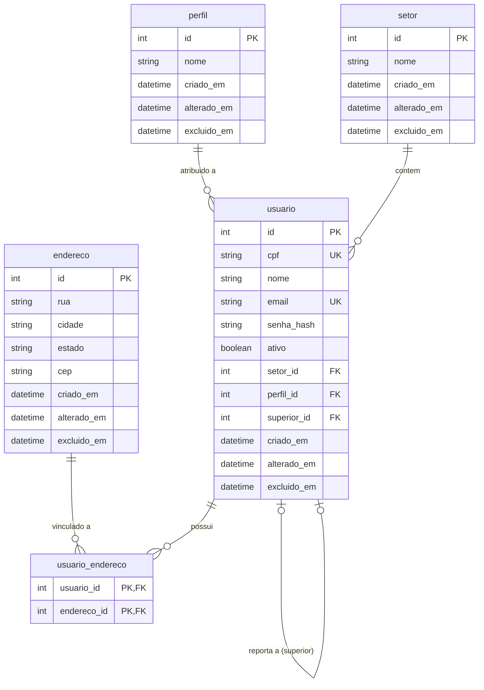
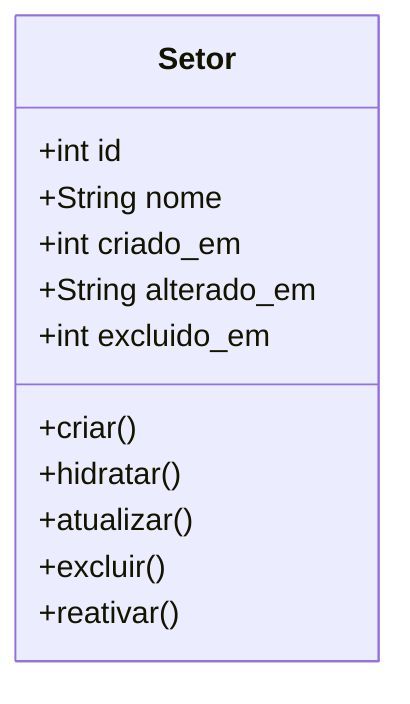
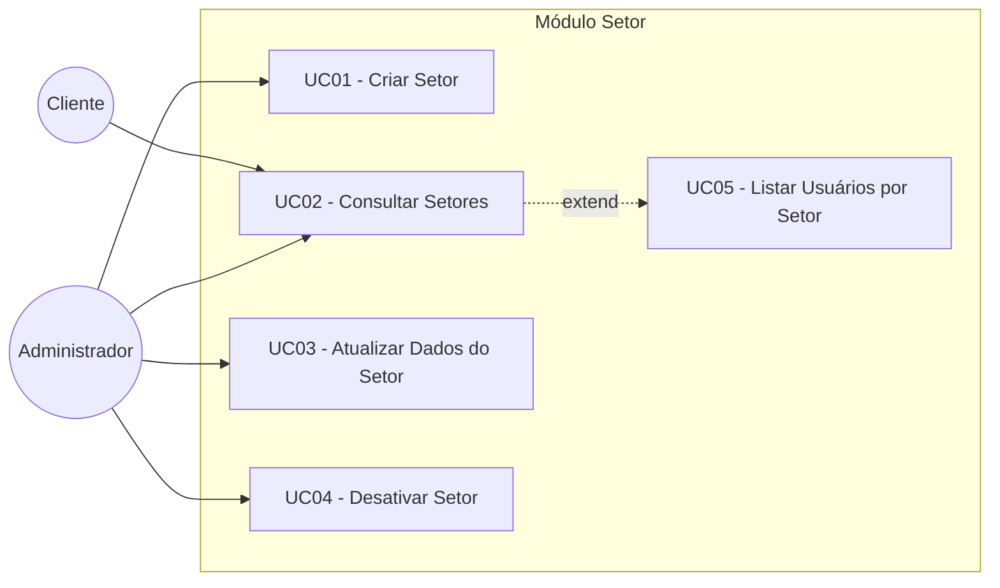

# Fastify-Gerenciamento de Usuarios

## Introdução e Objetivo

Este presente projeto tem como objetivo aplicar os conceitos aprendidos em livros e vídeo-aulas em relação à _Arquitetura Hexagonal_ e _Arquitetura Limpa_. Com a regra clara de não utilizar IA para escrever este projeto, mas apenas documentações externas, livros e muita lógica, tenho certeza de que irei aprender muito e solidificar meus conhecimentos mais abstratos.

## Diagrama Entidade Relacionamento

## Diagrama de Classes

# Diagramas de Casos de Uso

## Setor

Iniciando pela entidade de Setor, que é uma entidade básica do sistema e necessária para a criação do usuário, começaremos mapeando seus casos de uso:

