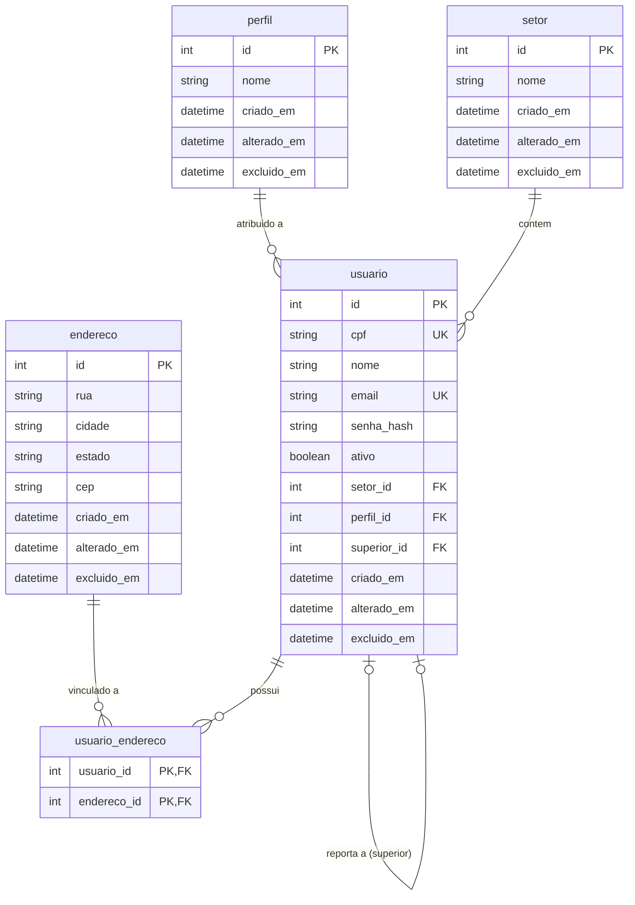

# Fastify-Gerenciamento de Usuarios

## Introdução e Objetivo

Este presente projeto tem como objetivo aplicar os conceitos aprendidos em livros e vídeo-aulas em relação à _Arquitetura Hexagonal_ e _Arquitetura Limpa_. Com a regra clara de não utilizar IA para escrever este projeto, mas apenas documentações externas, livros e muita lógica, tenho certeza de que irei aprender muito e solidificar meus conhecimentos mais abstratos.

## Diagrama Entidade Relacionamento

